# 🎓 Student Management System (SMS)

> A fully functional, role-based Student Management System built with **PHP**, **MySQL**, and **Vanilla JavaScript**. Designed to be cloned, rebranded, and deployed by any institution.


---

## 📸 Screenshots

### 🌐 Public Pages
| Home | About | Contact | Track Admission |
|------|-------|---------|----------------|
| 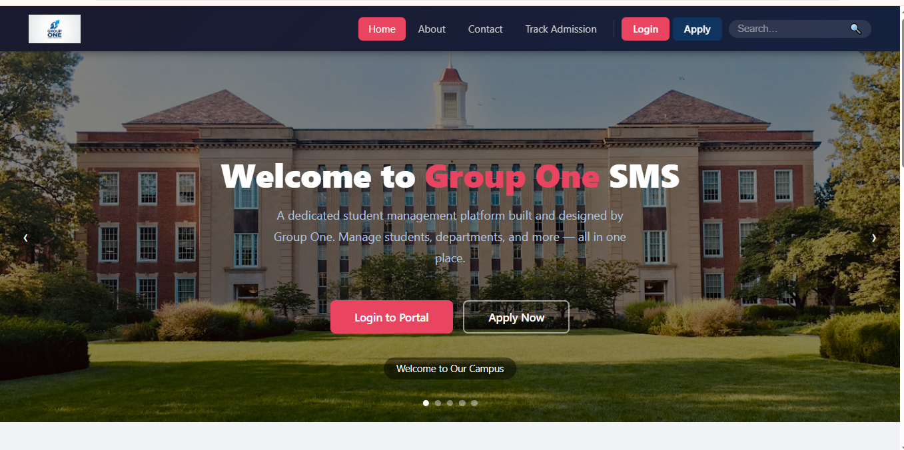 | 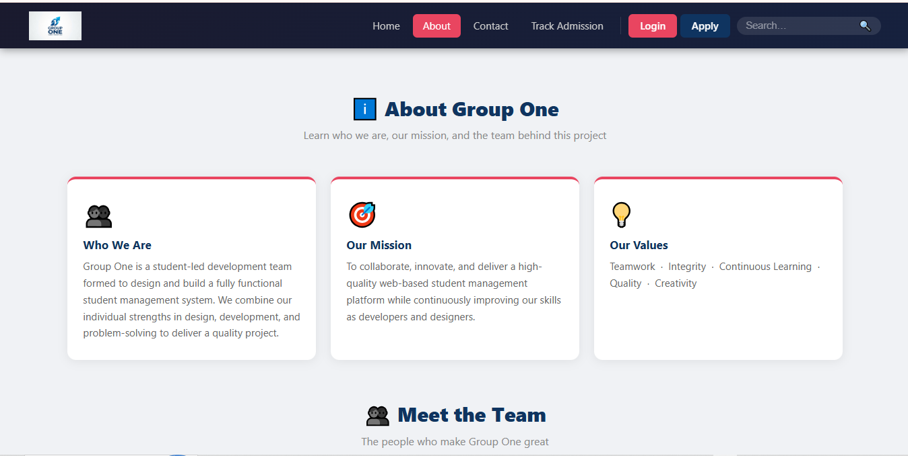 | 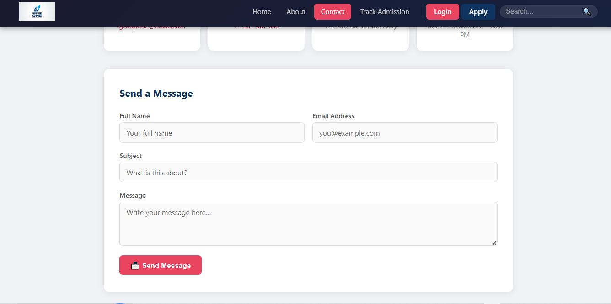 | 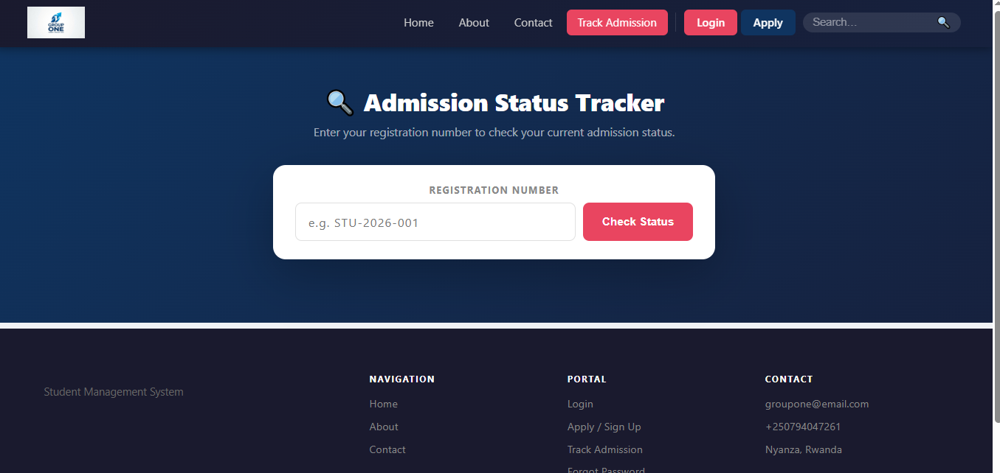 |

### 🔐 Auth
| Login | Application |
|-------|-------------|
| 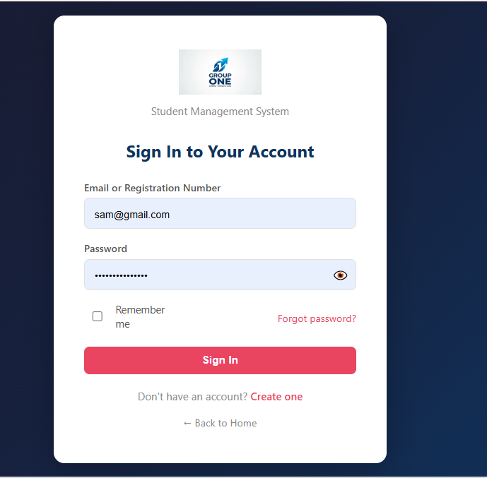 | 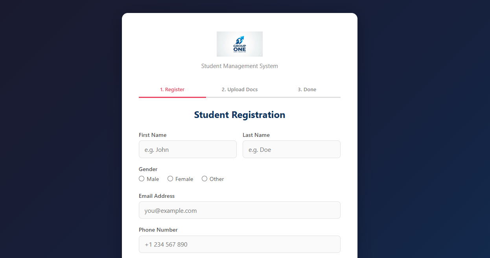 |

### 🛡️ Admin
| Dashboard | Students | Student Detail |
|-----------|----------|----------------|
| 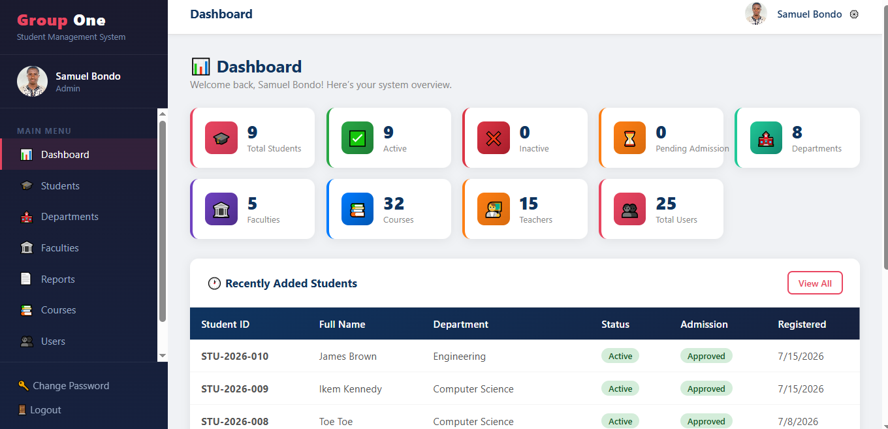 | 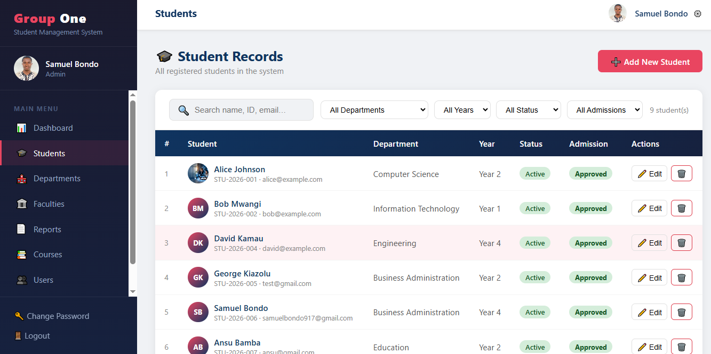 | 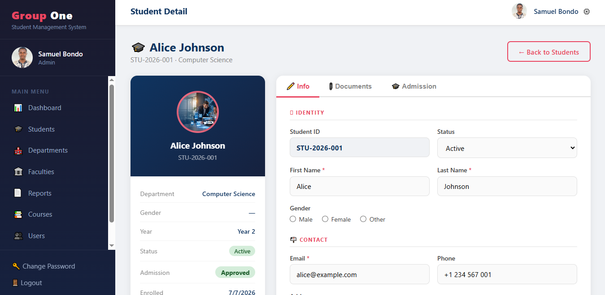 |

| Departments | Dept Detail | Courses |
|-------------|-------------|--------|
| 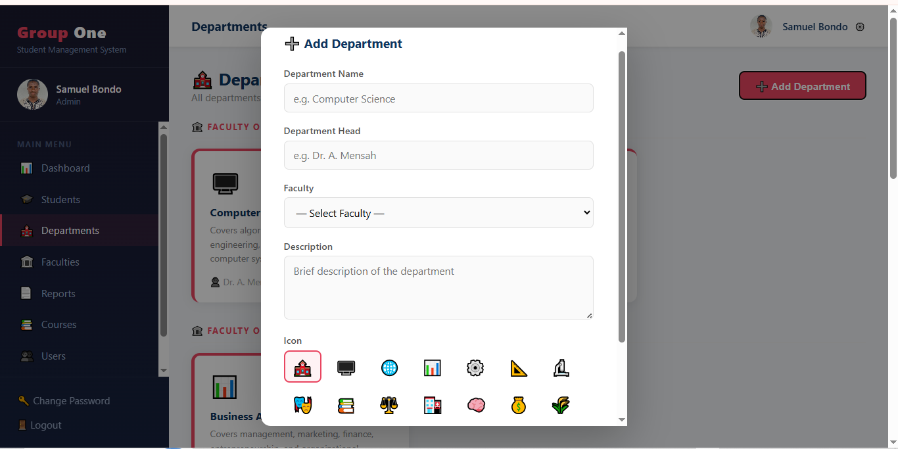 | 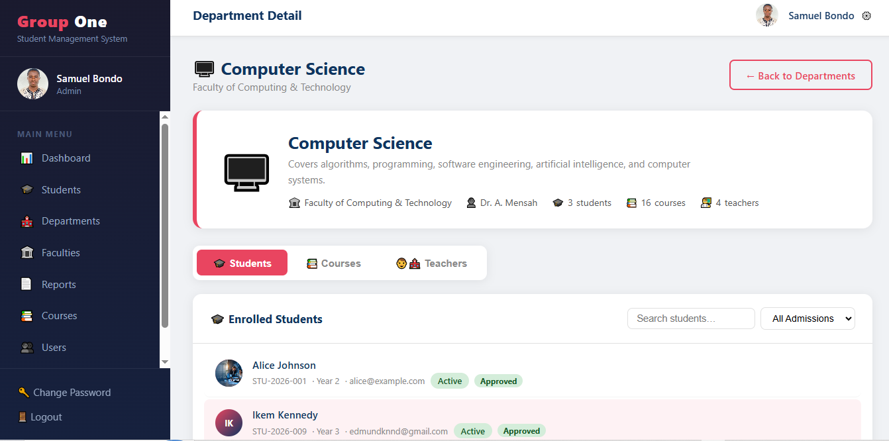 |  |

| Users | Reports | Settings |
|-------|---------|----------|
| 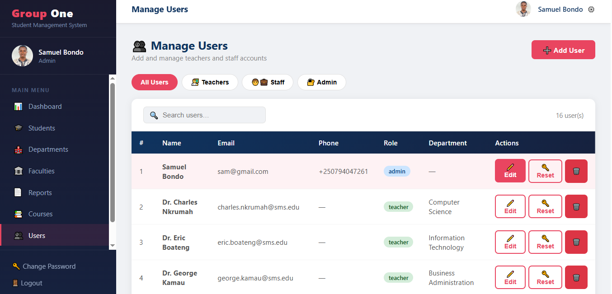 | 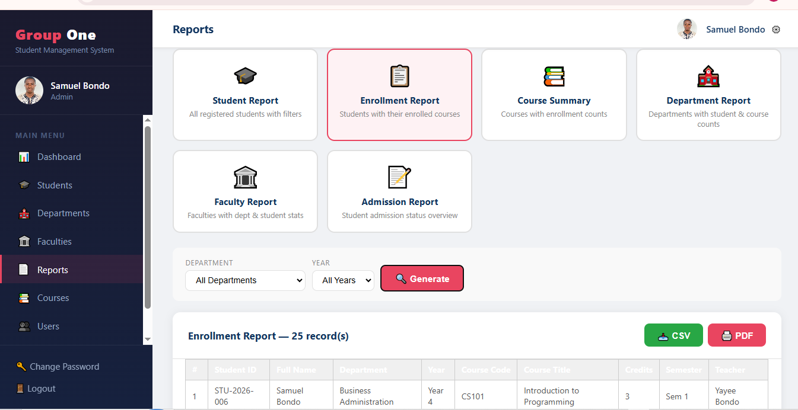 | 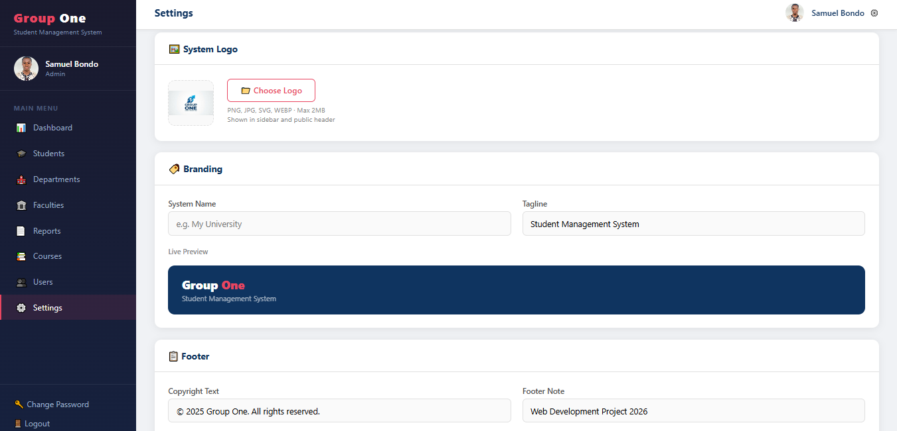 |

### 🎓 Student
| Dashboard | Enroll |
|-----------|--------|
| 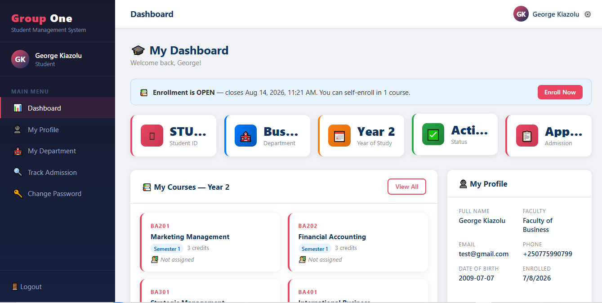 | 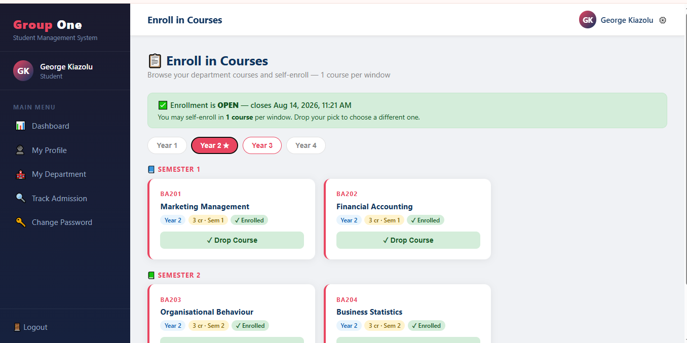 |

### 👨‍🏫 Teacher
| Dashboard | Classes | Students | Grades |
|-----------|---------|----------|--------|
| 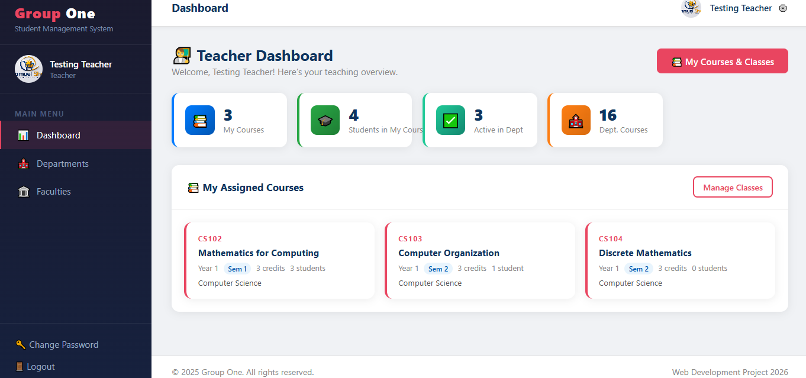 | 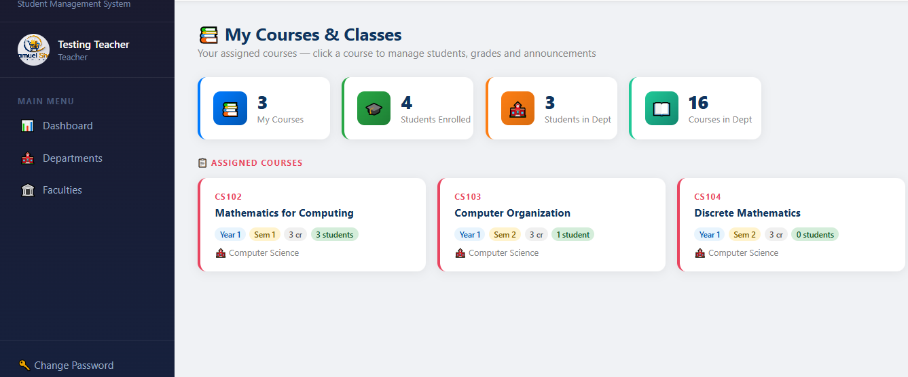 | 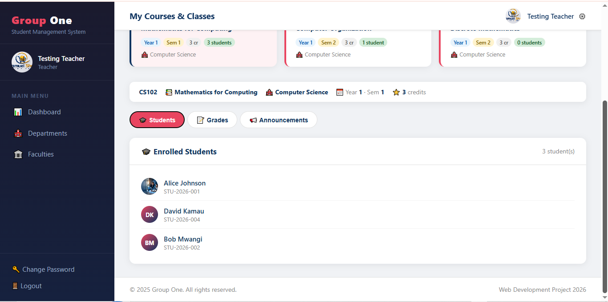 | 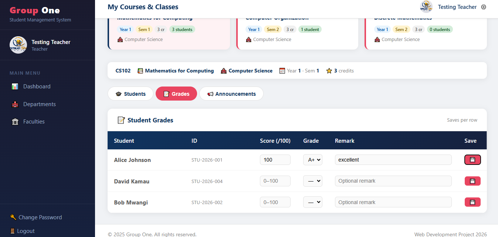 |

---

## ✨ Features

### 👥 Role-Based Access
| Role | Access |
|------|--------|
| **Admin** | Full access — students, departments, faculties, courses, users, reports, settings |
| **Staff** | Same as admin minus settings |
| **Teacher** | Dashboard, departments, faculties (read-only) |
| **Student** | Own dashboard, profile, department view, admission tracking |

### 🎓 Student Management
- Self-registration with auto-generated Student ID (`STU-YEAR-###`)
- 3-step signup: Register → Upload Documents → Done
- Admin approval workflow (Pending → Under Review → Approved / Rejected)
- Student login blocked until admission is approved
- Login with **email or Student ID**
- Full student profile edit, photo upload, password reset
- Suspend / Deactivate / Delete student accounts

### 🏫 Department & Faculty Management
- Full CRUD for departments and faculties
- Departments linked to faculties
- Department detail: enrolled students, courses, assigned teachers

### 📚 Course Management
- Add courses per department, year level, semester
- Assign teachers to courses
- **CSV Import** — bulk upload courses from a spreadsheet
- CSV format guide + downloadable template

### 👤 User Management
- Add teachers, staff, admin accounts
- Edit user details, department assignment
- Role filter tabs: All / Teachers / Staff / Admin
- Reset passwords, delete users

### 📄 Reports (Admin/Staff only)
- **Student Report** — filterable by department, year, status; includes gender
- **Department Report** — student counts per department
- **Faculty Report** — faculty overview with stats
- **Admission Report** — all students with admission status and gender
- Download any report as **PDF** via browser print

### ⚙️ System Settings (Admin only)
- Change system name and tagline — reflects everywhere instantly
- Customize footer copyright and note
- Update contact email, phone, address
- Live preview as you type — no code editing needed

### 🔐 Security
- Password strength indicator on signup (Very Weak → Very Strong)
- Minimum **Fair** strength required on registration
- Show/hide password toggle on login and signup
- Role-based page access control (frontend + backend)
- Admin-only backend endpoints verified by email/role
- All queries use **PDO prepared statements** — no raw SQL

### 📋 Admission Tracking
- Public admission tracker — no login required
- Students track status with their registration number
- Timeline indicator: Pending → Under Review → Approved/Rejected
- Admin notes shown on tracker
- Submitted documents listed

### 📎 Document Management
- Students upload documents during signup
- Admin can upload/delete documents per student
- Supported: PDF, JPG, PNG, DOC, DOCX (max 5MB)

### 🌐 Public Pages
- Home page with live search
- About page
- Contact page with message form
- Track Admission (public, no login needed)

---

## 🛠️ Tech Stack

| Layer | Technology |
|-------|-----------|
| Frontend | HTML5, CSS3, Vanilla JavaScript (ES6) |
| Backend | PHP 8.x (PDO) |
| Database | MySQL 8.x |
| Server | Apache (XAMPP) |
| Auth | localStorage session |
| PDF | Browser Print API |

---

## 🚀 Installation & Setup

> This project works for both **local development** and **live production**. As long as your environment has PHP 8.x, MySQL 8.x, and Apache (or any compatible web server), it will run. Just configure `php/db.php` with your server's database credentials and you're good to go.

### Requirements
- PHP 8.0+
- MySQL 8.0+
- Apache (XAMPP locally, or any shared/VPS hosting with Apache + PHP support)

### Steps

**1. Clone the repository**
```bash
git clone https://github.com/samuelbondo/innovation-hub.git
cd innovation-hub
```

**2. Move to your web server root**
```
# XAMPP on Windows
C:\xampp\htdocs\group1\

# XAMPP on Mac/Linux
/Applications/XAMPP/htdocs/group1/
```

**3. Create the database**
```sql
CREATE DATABASE group1_db CHARACTER SET utf8mb4 COLLATE utf8mb4_unicode_ci;
```

**4. Import the database**
```bash
mysql -u root group1_db < db/group1.sql
```
Or use **phpMyAdmin** → Import → select `db/group1.sql`

**5. Configure database connection**

Copy the example config and fill in your credentials:
```bash
cp php/db.example.php php/db.php
```

Edit `php/db.php`:
```php
define('DB_HOST', 'localhost');
define('DB_USER', 'root');       // your MySQL username
define('DB_PASS', '');           // your MySQL password
define('DB_NAME', 'group1_db');
```

> `php/db.php` is in `.gitignore` and will never be committed.

**6. Set upload permissions** *(Linux/Mac only)*
```bash
chmod 755 uploads/
chmod 755 uploads/docs/
```
> On Windows/XAMPP this is handled automatically.

**7. Open in browser**
```
http://localhost/group1/
```

---

## 🔑 Default Login Credentials

| Role | Email | Password |
|------|-------|----------|
| Admin | `sam@gmail.com` | `Yayeebondo1996!` |
| Teacher | `alan.mensah@sms.edu` | `password` |
| Student | `alice@example.com` | `password` |

> ⚠️ **Change all default passwords immediately after first login.**

---

## 🗂️ Project Structure

```
group1/
├── index.php                  # Public home page + live search
├── login.php                  # Login page (email or Student ID)
├── signup.php                 # Student self-registration (3-step)
├── dashboard.php              # Role-based dashboard
├── forgot_password.php        # Password recovery
├── about.php                  # Public about page
├── contact.php                # Public contact page
├── track_admission.php        # Public admission tracker
│
├── ── Admin / Staff Pages ──
├── view_student.php           # Student list + filters + pending banner
├── new_student.php            # Add student manually
├── student_detail.php         # Edit/manage individual student
├── department.php             # Department management
├── department_detail.php      # Department detail view
├── faculties.php              # Faculty management
├── manage_courses.php         # Course management + CSV import
├── manage_users.php           # User management (teachers/staff/admin)
├── reports.php                # PDF report generator
├── settings.php               # System branding & settings (admin only)
│
├── ── All Roles ──
├── profile.php                # View profile
├── change_password.php        # Change password
│
├── ── Student Pages ──
├── my_profile.php             # Student self-edit profile
├── my_department.php          # Student department view
│
├── shared.js                  # Auth guard + sidebar + topbar (all pages)
├── style.css                  # Master stylesheet
│
├── php/                       # Backend API endpoints
│   ├── db.example.php         # DB config template (copy to db.php)
│   ├── db.php                 # PDO connection (gitignored)
│   ├── login.php              # Login + role-based blocking
│   ├── signup.php             # Student registration handler
│   ├── dashboard.php          # Dashboard data API
│   ├── get_students.php       # Student list/single fetch
│   ├── update_student.php     # Student update/delete
│   ├── upload_photo.php       # Photo upload handler
│   ├── update_profile.php     # Student self-profile update
│   ├── reset_password.php     # Password reset
│   ├── get_departments.php    # Departments API
│   ├── manage_departments.php # Department CRUD
│   ├── get_faculties.php      # Faculties + departments API
│   ├── get_courses.php        # Courses list API
│   ├── manage_courses.php     # Course/user CRUD + teacher assign
│   ├── import_courses.php     # CSV course import handler
│   ├── documents.php          # Document upload/list/delete + admission update
│   ├── reports.php            # Report data API (admin/staff only)
│   ├── get_settings.php       # System settings API
│   ├── save_settings.php      # Save settings API
│   ├── search.php             # Public search API
│   ├── pub_header.php         # Public site header (dynamic)
│   └── pub_footer.php         # Public site footer (dynamic)
│
├── uploads/                   # Student photos (gitignored)
│   ├── .gitkeep
│   └── docs/                  # Student documents (gitignored)
│       └── .gitkeep
│
└── db/
    └── group1.sql             # Full database dump (schema + seed data)
```

---

## 🗄️ Database Schema

| Table | Description |
|-------|-------------|
| `students` | Student records with admission status |
| `users` | Login accounts for all roles |
| `departments` | Department records linked to faculties |
| `faculties` | Faculty records |
| `courses` | Course catalogue per department |
| `teacher_courses` | Teacher-to-course assignments |
| `student_documents` | Uploaded admission documents |
| `settings` | System branding and configuration |

---

## 🎨 Rebranding (No Code Needed)

1. Log in as **Admin**
2. Go to **⚙️ Settings** in the sidebar
3. Change:
   - System Name (e.g. `University of Ghana`)
   - Tagline (e.g. `Academic Management Portal`)
   - Footer copyright & note
   - Contact email, phone, address
4. Click **💾 Save Settings**

Everything updates instantly — sidebar, login page, public header, footer, page titles.

---

## 📄 CSV Course Import Format

Prepare a `.csv` file with these columns:

```csv
code,title,department,year_level,semester,credits
CS101,Introduction to Programming,Computer Science,1,1,3
IT201,Networking Fundamentals,Information Technology,2,1,3
```

Download the template from **Manage Courses → 📄 CSV Template**.

---

## 🔒 Security Notes

- All admin/staff backend endpoints verify the requesting user's role from the database
- Students are blocked from login until admission is **Approved**
- Password strength enforced on signup (minimum **Fair** strength required)
- Role-based access enforced on both frontend (`shared.js`) and backend (PHP)
- No raw SQL — all queries use **PDO prepared statements**
- `php/db.php` is gitignored — credentials never committed

---

## 📝 GitHub Topics

Add these to your repository for discoverability:

```
php mysql student-management-system web-application
role-based-access-control admission-system dashboard
vanilla-javascript crud-application xampp apache
school-management academic-system open-source
```

---

## 🤝 Contributing

Pull requests are welcome. For major changes, please open an issue first.

1. Fork the repository
2. Create your feature branch (`git checkout -b feature/AmazingFeature`)
3. Commit your changes (`git commit -m 'Add AmazingFeature'`)
4. Push to the branch (`git push origin feature/AmazingFeature`)
5. Open a Pull Request

---

## 📋 Roadmap / Future Features

- [ ] Email notifications on admission approval
- [ ] Student grade/result management
- [ ] Timetable/schedule module
- [ ] Bulk student import via CSV
- [ ] SMS notifications
- [ ] Dark mode
- [ ] Two-factor authentication
- [ ] Docker support

---

## 📜 License

This project is licensed under the **MIT License** — see the [LICENSE](LICENSE) file for details.

---

## 👨‍💻 Authors

> _Built by Samuel Bondo_

- **Samuel Bondo — [github.com/samuelbondo](https://github.com/samuelbondo) — Web Development Project 2026

---

## 🙏 Acknowledgements

- [XAMPP](https://www.apachefriends.org/) — Local development server
- [PHP PDO](https://www.php.net/manual/en/book.pdo.php) — Database abstraction
- Icons — Unicode Emoji

---

*Built with ❤️ — Ready to deploy, ready to rebrand.*

